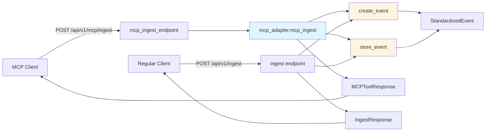

# MCP Compatibility Layer Implementation Plan

## Overview

Add a minimal MCP (Model Context Protocol) compatibility layer to the existing Copy/Paste system. This is an adapter that wraps the existing ingestion logic, demonstrating MCP principles (stable contracts, adapters, tool-oriented interface) without modifying core functionality.

## Architecture

The MCP adapter will be a thin wrapper around the existing ingestion pathway:

```
MCP Request → mcp_adapter.py → create_event() + store_event() → Same as /api/v1/ingest
```

No duplicate logic, no parallel pipelines, no changes to existing behavior.

## Implementation Steps

### 1. Add MCP Data Models

**File:** `backend/app/models.py`

Add two new Pydantic models after the existing request/response models:

- **MCPIngestRequest:**
  - `tool: Literal["ingest"]` - Tool identifier
  - `input_type: Literal["url", "text", "pdf"]` - Same as IngestRequest
  - `value: str` - Same as IngestRequest
  - `metadata: Dict[str, Any] = Field(default_factory=dict)` - Optional metadata
  - `correlation_id: Optional[str] = None` - Optional correlation ID for tracing

- **MCPToolResponse:**
  - `ok: bool` - Success/failure indicator
  - `event_id: Optional[UUID]` - Event ID on success
  - `error: Optional[str]` - Error message on failure

These models follow MCP conventions: tool-oriented structure, explicit success/failure, optional correlation tracking.

### 2. Create MCP Adapter Module

**File:** `backend/app/modules/ingestion/mcp_adapter.py` (new file)

Create a thin adapter that:
- Accepts `MCPIngestRequest`
- **Explicitly validates `tool == "ingest"` with clear v1 message** (shows versioning strategy)
- Calls the exact same `create_event()` function used by `/api/v1/ingest`
- Calls the exact same `store_event()` function
- Returns `MCPToolResponse` with appropriate success/error handling
- Preserves all existing validation and error handling

Key implementation:
```python
async def mcp_ingest(request: MCPIngestRequest) -> MCPToolResponse:
    if request.tool != "ingest":
        return MCPToolResponse(
            ok=False,
            error="Only 'ingest' tool is supported in MCP v1"
        )
    
    try:
        event = await create_event(request.input_type, request.value, request.metadata)
        store_event(event)
        return MCPToolResponse(ok=True, event_id=event.event_id)
    except Exception as e:
        return MCPToolResponse(ok=False, error=str(e))
```

### 3. Add MCP Endpoint

**File:** `backend/app/main.py`

Add new endpoint after the existing `/api/v1/ingest` endpoint:

```python
@app.post("/api/v1/mcp/ingest", response_model=MCPToolResponse)
async def mcp_ingest_endpoint(request: MCPIngestRequest):
    """
    MCP-compatible ingestion endpoint.
    
    Tool-oriented interface that wraps the existing ingestion logic.
    Returns MCP-style response with explicit ok/error structure.
    """
    from app.modules.ingestion.mcp_adapter import mcp_ingest
    return await mcp_ingest(request)
```

Import the new models at the top:
```python
from app.models import (
    IngestRequest, IngestResponse,
    ScrubRequest, ScrubResponse,
    DraftRequest, DraftResponse,
    MCPIngestRequest, MCPToolResponse  # Add these
)
```

### 4. Fix Missing Import in event_creator.py

**File:** `backend/app/modules/ingestion/event_creator.py`

Add missing imports at the top:
```python
from typing import Literal, Optional, Dict, Any
```

This fixes a bug where `Optional[Dict[str, Any]]` is used but not imported.

### 5. Create MCP Documentation

**File:** `docs/MCP.md` (new file)

Document:
- **Available Tools:**
  - `ingest(url | text | pdf)` → `event_id`
  - Note: `scrub` and `generate_draft` exist but are not yet exposed as MCP tools (v1 scope is ingestion only)

- **Why scrub/draft are not MCP tools (yet):**
  > "Scrub and generate_draft are intentionally not exposed as MCP tools in v1, as they require stronger guarantees around privacy state and execution context."

- **MCP Compatibility (5-10 lines):**
  - Stable contracts: Pydantic models ensure type safety
  - Tool-like endpoints: `/api/v1/mcp/ingest` follows MCP tool pattern
  - Adapter-based integration: Thin wrapper, no duplication
  - No hidden state: All state is explicit in requests/responses

- **Example Request/Response:**
  ```json
  Request: {"tool": "ingest", "input_type": "url", "value": "https://example.com"}
  Response: {"ok": true, "event_id": "uuid", "error": null}
  ```

Keep it technical, no marketing fluff.

### 6. Add Tests

**File:** `scripts/test_mcp.py` (new file)

Follow the existing test pattern from `scripts/test_pipeline.py`:

**Test 1: Valid MCP Request**
- POST to `/api/v1/mcp/ingest` with valid URL
- Assert: `ok=true`, `event_id` exists, `error` is null
- Verify event can be scrubbed (call `/api/v1/privacy/scrub` with returned `event_id`)

**Test 2: Invalid MCP Request**
- POST with invalid payload (e.g., missing `tool` field, invalid `input_type`)
- Assert: `422` status code OR `ok=false` with clear error message

**Test 3: Unknown Tool**
- POST with `tool="unknown"`
- Assert: `ok=false`, error message indicates only 'ingest' is supported in v1

Use `requests` library like existing tests, test against running server.

### 7. Optional: Update Scout (Only if Trivial)

**File:** `scout/rss_watcher.py`

If updating Scout is trivial (just changing the endpoint URL), update line ~103:
```python
response = await self.client.post(
    f"{self.backend_url}/api/v1/mcp/ingest",  # Changed from /api/v1/ingest
    json={
        "tool": "ingest",  # Add tool field
        "input_type": input_type,
        "value": value,
        "metadata": metadata
    }
)
```

**Decision:** Only do this if it's a simple find/replace. If there are complications (e.g., error handling differences), skip it.

## Data Flow



Both endpoints use the exact same internal functions (`create_event`, `store_event`).

## Security & GDPR Guarantees

All existing guarantees remain intact:
- No new persistence of raw text or PII
- Same validation rules apply
- Same error handling
- Same privacy-safe logging
- Rate limiting applies to new endpoint automatically (via middleware)

## Definition of Done

- [ ] `POST /api/v1/mcp/ingest` works and returns `event_id` for valid requests
- [ ] Existing `/api/v1/ingest` behavior is unchanged
- [ ] All tests pass (new MCP tests + existing tests)
- [ ] Security & GDPR guarantees remain intact
- [ ] Documentation clearly explains MCP value and why scrub/draft are not tools in v1
- [ ] Scout still works (whether updated or not)
- [ ] No scope creep introduced
- [ ] Explicit v1 guard in code shows versioning strategy

## Files to Create/Modify

**Create:**
- `backend/app/modules/ingestion/mcp_adapter.py`
- `docs/MCP.md`
- `scripts/test_mcp.py`

**Modify:**
- `backend/app/models.py` (add MCPIngestRequest, MCPToolResponse)
- `backend/app/main.py` (add endpoint, import models)
- `backend/app/modules/ingestion/event_creator.py` (fix missing imports)
- `scout/rss_watcher.py` (optional, only if trivial)

## Testing Strategy

1. Run existing test suite to ensure no regressions
2. Run new MCP tests
3. Manual verification: Compare MCP endpoint behavior with regular endpoint
4. Verify Scout still works (if updated, test Scout; if not, verify it still uses old endpoint)

